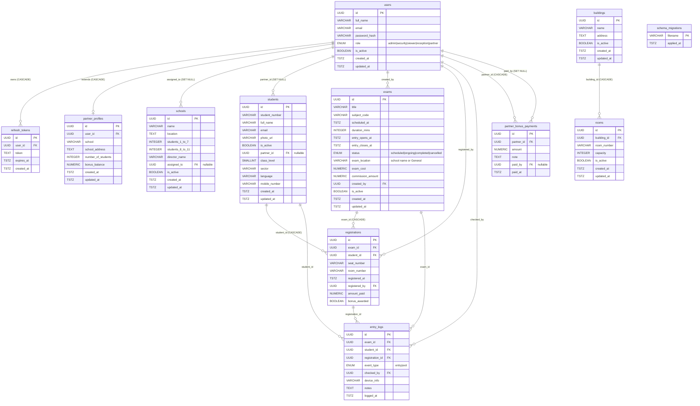

# Database Table Relations — examdb

---

## Quick Reference: Foreign Keys

| Child Column | → Parent Table | On Delete |
|---|---|---|
| `refresh_tokens.user_id` | `users.id` | CASCADE |
| `partner_profiles.user_id` | `users.id` | CASCADE |
| `schools.assigned_to` | `users.id` | SET NULL |
| `students.partner_id` | `users.id` | SET NULL |
| `exams.created_by` | `users.id` | *(restrict)* |
| `registrations.exam_id` | `exams.id` | CASCADE |
| `registrations.student_id` | `students.id` | CASCADE |
| `registrations.registered_by` | `users.id` | *(restrict)* |
| `entry_logs.exam_id` | `exams.id` | *(restrict)* |
| `entry_logs.student_id` | `students.id` | *(restrict)* |
| `entry_logs.registration_id` | `registrations.id` | *(restrict)* |
| `entry_logs.checked_by` | `users.id` | *(restrict)* |
| `partner_bonus_payments.partner_id` | `users.id` | CASCADE |
| `partner_bonus_payments.paid_by` | `users.id` | SET NULL |
| `rooms.building_id` | `buildings.id` | CASCADE |

> `buildings` and `rooms` are **legacy** — `exams.room_id` was dropped in migration `008`. They remain in the database but are no longer referenced by any active table.

---

## Unique Constraints

| Table | Unique On |
|---|---|
| `users` | `email` |
| `refresh_tokens` | `token` |
| `students` | `student_number`, `email` |
| `partner_profiles` | `user_id` |
| `registrations` | `(exam_id, student_id)`, `(exam_id, seat_number)` |
| `rooms` | `(building_id, room_number)` |
